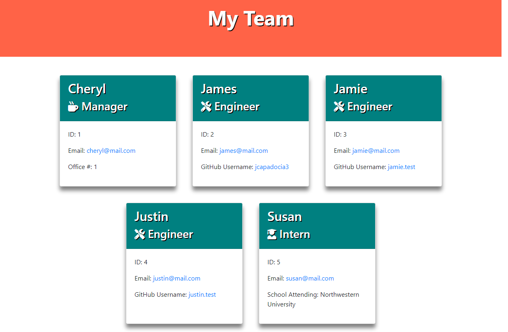

[](https://opensource.org/licenses/MIT)
  
# Team Profile Generator

## Link to public repo on Github:

https://github.com/jcapadocia3/Team-Profile-Generator

## Disclaimer

Currently, only one GitHub link under the Enigneer name "James" is a working link in which it will redirect the user to a proper GitHub profile (my GitHub profile) when clicked. All other Engineers will have a working link but the link will not lead to an active GitHub profile as only placeholders were input for these "fake" employees.

Please refer to the newINDEX.html file in the repo to see the final product created by the code as shown in the Video Walkthroughs.

***The frameworkINDEX.html is intended to write and test code for what the final product should look like before implementing the code in the generateHTML.js file.***

## Table of Contents
1. [Description](#Description)
2. [Final Product Image and Video Walkthroughs](#Final-Product-Image-and-Video-Walkthroughs)
3. [User Story](#User-Story)
4. [Installation and Instructions](#Installation-and-Instructions)
5. [License](#License)
6. [Questions](#Questions)

## Description
The purpose of this project is to allow a user to generate a Team Profile for the conrtibutors taking part in a project. This project will run through Node via the command line and bring the user through a series of prompts to complete information regarding these team members. Once all prompts are completed, an HTML file will automatically be created with the user's input about the team members.

## Final Product Image and Video Walkthroughs

- Image of final product website created<br>


- Walkthrough of how the app works via the command line<br>
<a target="_blank" href="https://watch.screencastify.com/v/ohTzBjC4r7mOxOqpc7wf">Click Here</a>

- Walkthrough of tests created for the constructors in project<br>
<a target="_blank" href="https://watch.screencastify.com/v/3DE0k7kSpNX7HTckZy1C">Click Here</a>

## User Story
```md
GIVEN a command-line application that accepts user input

WHEN I am prompted for my team members and their information
THEN an HTML file is generated that displays a nicely formatted team roster based on user input

WHEN I click on an email address in the HTML
THEN my default email program opens and populates the TO field of the email with the address

WHEN I click on the GitHub username
THEN that GitHub profile opens in a new tab

WHEN I start the application
THEN I am prompted to enter the team manager’s name, employee ID, email address, and office number

WHEN I enter the team manager’s name, employee ID, email address, and office number
THEN I am presented with a menu with the option to add an engineer or an intern or to finish building my team

WHEN I select the engineer option
THEN I am prompted to enter the engineer’s name, ID, email, and GitHub username, and I am taken back to the menu

WHEN I select the intern option
THEN I am prompted to enter the intern’s name, ID, email, and school, and I am taken back to the menu

WHEN I decide to finish building my team
THEN I exit the application, and the HTML is generated
```

## Installation and Instructions
- Download app files via GitHub
- Open GitBash/Terminal to access the command line
- Via the command line, install Jest Package into the working directory (used to test the constructors for the project)
- Via the command line, type "npm test" to run tests created
- Via the command line, install Inquirer Package into the working directory
- Via the command line, type "node index.js"
- Proceed to answer the prompts the command line walks you through
- Upon completion of the prompts, an HTML file will be created using the user input from prompts

## License
- MIT License
- Copyright 2021

    Permission is hereby granted, free of charge, to any person obtaining a copy of this software and associated documentation files (the "Software"), to deal in the Software without restriction, including without limitation the rights to use, copy, modify, merge, publish, distribute, sublicense, and/or sell copies of the Software, and to permit persons to whom the Software is furnished to do so, subject to the following conditions:
    
    The above copyright notice and this permission notice shall be included in all copies or substantial portions of the Software.
    
    THE SOFTWARE IS PROVIDED "AS IS", WITHOUT WARRANTY OF ANY KIND, EXPRESS OR IMPLIED, INCLUDING BUT NOT LIMITED TO THE WARRANTIES OF MERCHANTABILITY, FITNESS FOR A PARTICULAR PURPOSE AND NONINFRINGEMENT. IN NO EVENT SHALL THE AUTHORS OR COPYRIGHT HOLDERS BE LIABLE FOR ANY CLAIM, DAMAGES OR OTHER LIABILITY, WHETHER IN AN ACTION OF CONTRACT, TORT OR OTHERWISE, ARISING FROM, OUT OF OR IN CONNECTION WITH THE SOFTWARE OR THE USE OR OTHER DEALINGS IN THE SOFTWARE.

## Questions
- GitHub Profile: <a href="https://github.com/jcapadocia3">jcapadocia3</a><br>
- My Email: james.capadocia@gmail.com<br>
***Please feel free to contact me for more information***